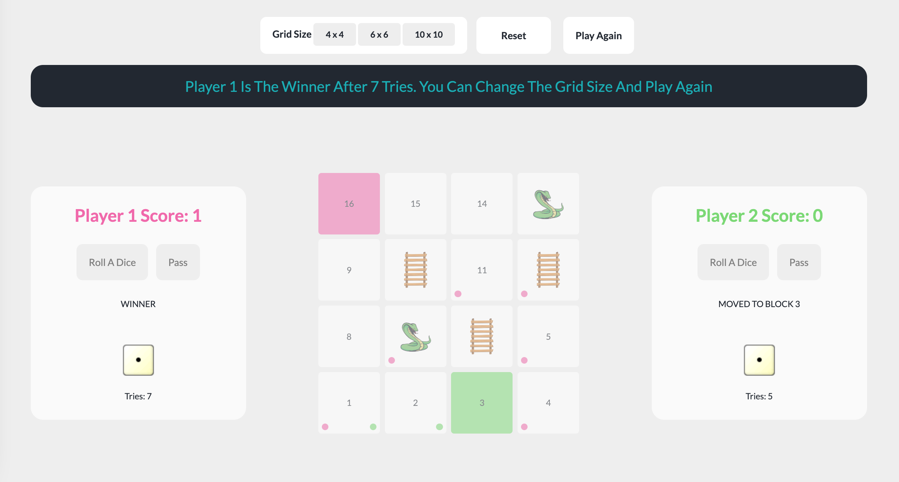

# GA Software Engineering Immersive: Project 1 - Game

## Snakes and Ladders Game

## Built With

- HTML
- CSS
- JavaScript

## The Game

The game is inspired by Snakes and Ladders Game, where two player can play the game or one player agains computer. Users can choose between three different grid sizes and the winner is decided in three rounds. Once a player start the game, Snakes and Ladders will added randomly to the grid. Player to start will be chose randomly. Player can roll a dice or can Pass his turn to the next player if he feels unlucky, in playing aginst computer this option is only available to the player and the computer will not do a Pass. For a player to start moving he has to get dice of 6 or he has to try until he reach a specified number of tries -2-then he will start moving even if he did not get dice of 6. If a player gets a dice of 6, then he can play for another turn. Once a player started to move, he will face some blocks that has Snakes and some has Ladders. Snakes block will make the player return back to a randomly chosen block. Ladder blocks will make the player jump to a higher block that is also randomly chosen. While moving, circle indicator will be added to each player previously visited blocks. The winner of a round is the one who reaches first to the last block. After winning the players score will be updated and they can continue playing for a another round and they have the option to change the grid size. Reset button will reset the game data to default.

## Future improvements

- The game can be made responsive, e.g. for mobile phone the grid size will be 4 x 4, and it the default of it will be playing against computer.
